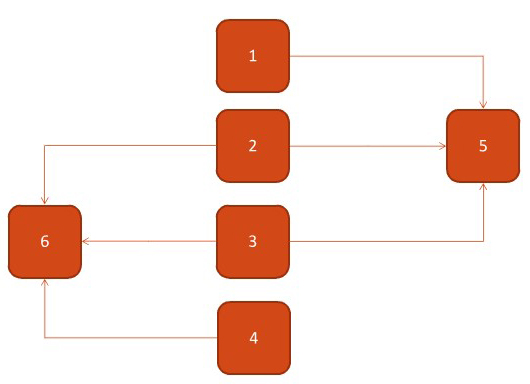

## Java Concurrency

Java concurrency is pretty complex topic and requires a lot of attention while writing application code dealing with multiple threads accessing one/more shared resources at any given time. Java 5, introduced some classes like BlockingQueue and Executors which take away some of the complexity by providing easy to use APIs.

Programmers using concurrency classes will feel a lot more confident than programmers directly handling synchronization stuff using wait(), notify() and notifyAll() method calls. I will also recommend to use these newer APIs over synchronization yourself, BUT many times we are required to do so for various reasons e.g. maintaining legacy code. A good knowledge around these methods will help you in such situation when arrived.

To achieve concurrency we can created a class that extends Thread (as we will be dealing with threads) and have some verification logic to check whether that Thread got executed or not.

```java
class CThread extends Thread{
    // the message we would want to print later on
    private String msg;
    // array of threads that this object should wait (be locked) for
    private CThread[] waitFor = new CThread[0];
    // when this objects thread finishes its work we set this variable to true
    private boolean hasRun = false;

    // constructor that sets the msg
    CThread(String msg) {
        this.msg = msg;
    }

    // providing an array to this method will indicate which threads to lock on
    void waitFor(CThread... waitFor){
        this.waitFor = new CThread[waitFor.length];
        System.arraycopy(waitFor, 0, this.waitFor, 0, waitFor.length);
    }

    // we lock on to Thread if it was not run yet, else we assume it finished executing
    private void wait(int i){
        synchronized (this.waitFor[i]) {
            try {
                if (!this.waitFor[i].hasRun)
                    this.waitFor[i].wait();
            } catch (Exception ignored) {}
        }
    }

    // when we start our object, it will run this code in its own thread
    public void run(){
        // lock on each Thread we indicated using waitFor method
        for (int i = 0; i < this.waitFor.length; i++)
            wait(i);

        // once lock is released, we print our msg
        System.out.println(this.msg);

        // and tell every waiting object that this thread has finished executing
        synchronized (this) {
            this.notify();
            this.hasRun = true;
        }
    }
}
```

Now, lets test our class for the following graph:



```java
public static void main(String[] args){
    // Initialize threads;
    CThread t1 = new CThread("1");
    CThread t2 = new CThread("2");
    CThread t3 = new CThread("3");
    CThread t4 = new CThread("4");
    CThread t5 = new CThread("5");
    CThread t6 = new CThread("6");

    // Set dependencies
    t1.waitFor(t5);
    t2.waitFor(t5, t6);
    t3.waitFor(t5, t6);
    t4.waitFor(t6);

    // Run
    t1.start();
    t2.start();
    t3.start();
    t4.start();
    t5.start();
    t6.start();
}
```

Running this code will result in different outputs each time but the results will be correct. because we can't fully control the threads order.

<div style="-webkit-column-count: 2; -moz-column-count: 2; column-count: 2; -webkit-column-rule: 1px dotted #e0e0e0; -moz-column-rule: 1px dotted #e0e0e0; column-rule: 1px dotted #e0e0e0;">
    <div style="display: inline-block; width: 47%;">
        <pre><code class="language-java"><span>Output #1:</span>
6
4
5
1
3
2
</code></pre>
    </div>
    <div style="display: inline-block; width: 47%;">
        <pre><code class="language-java"><span>Output #2:</span>
5
1
6
4
2
3
</code></pre>
    </div>
</div>

---

### Conclusion

In simple words, concurrency is the ability to run several programs or several parts of a program in parallel. Concurrency enable a program to achieve high performance and throughput by utilizing the untapped capabilities of underlying operating system and machine hardware. e.g. modern computers has several CPU’s or several cores within one CPU, program can utilize all cores for some part of processing; thus completing task much before in time in comparison to sequential processing.

The backbone of java concurrency are threads. A thread is a lightweight process which has its own call stack, but can access shared data of other threads in the same process. A Java application runs by default in one process. Within a Java application you can work with many threads to achieve parallel processing or concurrency.